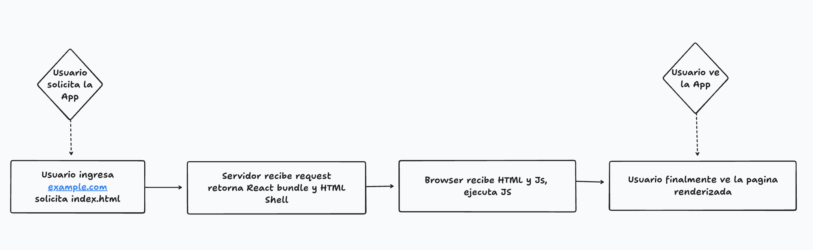
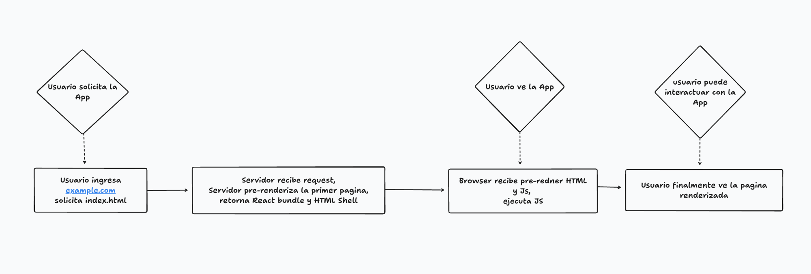

# Server-Side Rendering (SSR) con React

## CSR vs SSR

En un flujo sin SSR (CSR, client-side rendering), el servidor solo entrega un HTML vacío y el bundle de JS. El navegador tiene que descargar y ejecutar ese JS antes de que aparezca cualquier contenido en pantalla. El primer pintado y el momento en que la app se vuelve interactiva ocurren prácticamente al mismo tiempo, porque son la misma operación: React recién arma el DOM cuando el JS termina de ejecutarse en el navegador.



[Ver diagrama en tldraw](https://www.tldraw.com/f/z86yqByWljh6cgowDXyVG?d=v-157.-247.1944.1065.page)

Con SSR, el servidor ya manda el HTML de la primera página renderizado (con `renderToString`, no `renderToStaticMarkup` como en SSG, porque acá sí vamos a hidratar). El usuario ve contenido apenas llega ese HTML. Pero todavía no es interactivo: el navegador tiene que terminar de descargar el bundle de React y correr `hydrateRoot` para que los botones, inputs, etc. respondan. Por eso ahora "ver la app" y "poder interactuar con la app" son dos momentos distintos, separados en el tiempo.



[Ver diagrama en tldraw](https://www.tldraw.com/f/z86yqByWljh6cgowDXyVG?d=v-787.-175.2421.1326.sPkWatFWyKN2Z1qEElLoW)

## Los archivos del proyecto, y qué hace cada uno

### `App.js` — el componente

```js
import { createElement as h, useState } from "react";

function App() {
  const [count, setCount] = useState(0);
  return h(
    "div",
    null,
    h("h1", null, "Hello World"),
    h("p", null, "This is SSR"),
    h("button", { onClick: () => setCount(count + 1) }, `Count ${count}`),
  );
}

export default App;
```

A diferencia del ejemplo de SSG, este componente ya tiene estado (`useState`) y un evento (`onClick`). Ese es justamente el punto: SSR sirve para apps que necesitan interactividad real, no solo contenido estático. En el servidor este `useState` se ejecuta una sola vez con su valor inicial (`0`), porque `renderToString` no simula clicks ni efectos, solo produce el HTML del primer render.

### `index.html` — la shell

```html
<!doctype html>
<html lang="en">
  <head>
    <title>React SSR Example</title>
    <script async type="module" src="./Client.js"></script>
  </head>
  <body>
    <div id="root"><!--ROOT--></div>
  </body>
</html>
```

Misma idea de wildcard que en SSG (`<!--ROOT-->` se reemplaza por el HTML renderizado), pero ahora el `<head>` también incluye el `<script>` que carga `Client.js`. Eso es clave para el timing: el navegador descubre y empieza a descargar ese script apenas recibe el head, sin tener que esperar a que llegue el resto de la página.

### `Client.js` — lo que corre solo en el navegador

```js
import { hydrateRoot } from "react-dom/client";
import { createElement as h } from "react";
import App from "./App";

hydrateRoot(document.getElementById("root"), h(App));
```

`hydrateRoot` no vuelve a renderizar el HTML desde cero, toma el HTML que ya llegó del servidor y le agrega los event listeners y el estado de React. Es la contraparte de `renderToString`: uno arma el HTML en el servidor, el otro lo activa en el cliente. Cualquier cosa que dependa de APIs del navegador (Google Analytics, `localStorage`, `window`, etc.) va acá, porque este archivo nunca corre en Node.js.

### `server.js` — el servidor que renderiza

```js
import fastify from "fastify";
import fastifyStatic from "@fastify/static";
import { readFileSync } from "node:fs";
import { fileURLToPath } from "node:url";
import path, { dirname } from "node:path";
import { renderToString } from "react-dom/server";
import { createElement as h } from "react";
import App from "./App.js";

const __filename = fileURLToPath(import.meta.url);
const __dirname = dirname(__filename);

const shell = readFileSync(path.join(__dirname, "dist", "index.html"), "utf8");

const app = fastify();

app.register(fastifyStatic, {
  root: path.join(__dirname, "dist"),
  prefix: "/",
});

const parts = shell.split("<!--ROOT-->");
app.get("/", (req, reply) => {
  reply.raw.write(parts[0]);
  const reactApp = renderToString(h(App));
  reply.raw.write(reactApp);
  reply.raw.write(parts[1]);
  reply.raw.end();
});

app.listen({
  port: 3000,
});
```

Es basicamente un web server con fastify (podria ser Express tambien or Hono.js)

La parte importante es el handler de `"/"`:

1. La shell se corta en dos mitades usando `<!--ROOT-->` como separador (`parts[0]` es todo lo de antes, incluido el `<head>` con el `<script>`; `parts[1]` es todo lo de después).
2. Se escribe `parts[0]` primero y se envia al navegador. El navegador ya puede leer el `<head>`, encontrar el `<script src="./Client.js">` y arrancar la descarga del bundle de React en paralelo, sin esperar nada más.
3. Mientras eso descarga en el navegador, el servidor recién ahí llama a `renderToString(h(App))`, que es la parte que toma tiempo (es trabajo síncrono de CPU en el servidor).
4. Se escribe el HTML renderizado y después `parts[1]` para cerrar los tags.

Ese orden es lo que hace que, para cuando el navegador termina de descargar y ejecutar `Client.js`, el HTML renderizado ya llegó o está a punto de llegar. Las dos cosas que antes eran secuenciales (esperar el JS, después renderizar) ahora pasan en paralelo.

Un problema típico al hacer esto a mano: errores de hidratación por espacios en blanco. React es muy sensible a cualquier diferencia entre lo que el servidor renderizó y lo que el cliente encuentra en el DOM al hidratar. Si `<div id="root"><!--ROOT--></div>` tiene saltos de línea o espacios de más alrededor del comentario, React puede detectar un mismatch entre servidor y cliente.

## ¿Vale la pena usar SSR?

Con lo anterior en mente: el tiempo hasta ser interactivo (time to interactive) y el primer pintado significativo (first meaningful paint) ahora son momentos distintos. En el ejemplo de SSG/CSR ocurrían juntos, acá los separamos a propósito.

Esto puede sonar directamente mejor, y en muchos casos lo es: la gente ve contenido rápido y, antes de llegar a decidir hacer alguna acción, la app generalmente ya terminó de hidratarse. Se siente más rápida para el usuario, aunque el tiempo hasta ser interactivo casi siempre llega unas decenas de milisegundos después que en CSR puro, porque el servidor tiene que renderizar antes de responder y eso toma tiempo. Hay que tener cuidado con esta suposición, porque en algunos casos SSR no es más rápido.

SSR trae consigo complejidad: hay código que corre en el navegador y no puede correr en Node.js (por ejemplo, Google Analytics, que depende de APIs del navegador). Por eso hay que separar con cuidado qué corre en cada lado, como hicimos con `Client.js` y `server.js`.

En dispositivos rápidos con conexiones rápidas, tanto el primer pintado como el momento en que la app se vuelve interactiva van a tender a ser un poco más lentos con SSR. 
La clave es medir. SSR puede ser una gran herramienta en la caja de herramientas, pero hay que confirmar que realmente esté generando una diferencia positiva para los usuarios reales de la app, no asumirlo.
