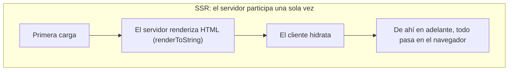
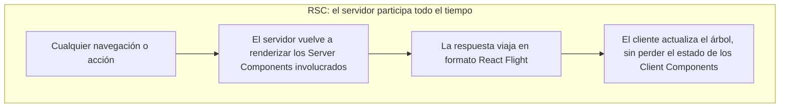
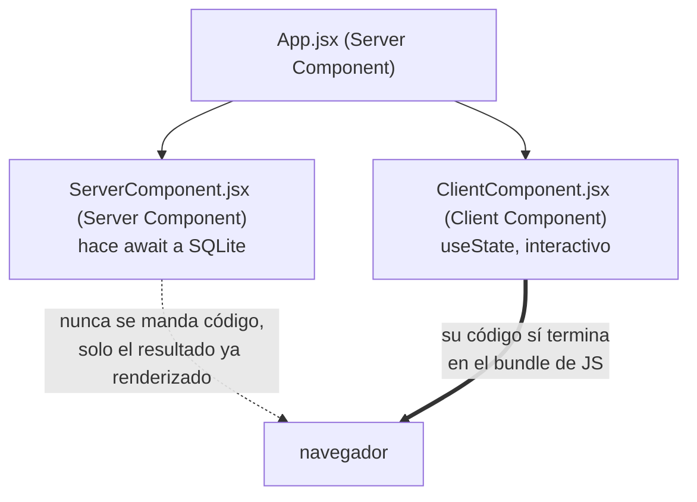

# React Server Components (RSC) sin framework

## Qué es un React Server Component

Un React Server Component es un componente que se renderiza únicamente en el servidor. Esto no es lo mismo que decir "se renderiza primero en el servidor" (eso es SSR): un RSC nunca llega a existir como código en el navegador. El cliente ni siquiera recibe el JavaScript del componente, solo el resultado ya renderizado, en un formato propio de React.

Es un error común pensar que los RSC son una evolución de SSR. Son dos ejes independientes: podés usar SSR sin RSC (como en la carpeta `02-ssr`), RSC sin SSR, ambos juntos, o ninguno. La diferencia central entre uno y otro está en cuánto dura la participación del servidor:





En SSR, una vez que el HTML inicial llegó y se hidrató, el servidor ya cumplió su función. En RSC, el servidor sigue involucrado en cada nueva porción de árbol que haga falta renderizar, durante toda la vida de la app.

## Por qué usarlos

- **Separar el contenido inerte del interactivo.** Gran parte de una app típica es texto y markup que no necesita `useState`, `useEffect` ni ningún hook. Los RSC dejan ese contenido en el servidor, sin dejar de convivir en el mismo código base que los componentes interactivos.
- **El rendimiento ya no depende del dispositivo del usuario.** El trabajo de renderizado lo hace el servidor, así que un celular viejo no tarda más que una laptop potente en mostrar el mismo contenido.
- **Mejor code splitting.** El navegador nunca descarga el código de un Server Component, porque nunca lo necesita ejecutar ahí. Menos JavaScript en el bundle final.
- **Acceso directo a la base de datos y a APIs privadas (el beneficio más grande).** Un Server Component puede hacer `await` a una query SQL directamente, sin pasar por un endpoint HTTP intermedio. Las credenciales (connection strings, API keys) quedan en el servidor y nunca se mandan al navegador, porque el código que las usa tampoco se manda.

## Por qué (casi) nadie escribe esto a mano en producción

Esta carpeta demuestra cómo armar RSC sin ningún framework, pero eso no es lo normal. Los RSC necesitan integración profunda con el bundler (hoy en día, básicamente solo Webpack la tiene resuelta), y están pensados para que los escriban frameworks (Next.js ya los soporta; React Router v7/Remix y TanStack Start los están incorporando), no para que cada developer configure Webpack a mano en cada proyecto. El protocolo que usan para mandar los datos (React Flight, más abajo) es además inestable y no está pensado para ser leído o escrito directamente por una persona.

## Los archivos del proyecto, y qué hace cada uno

### Configuración: `package.json`, `webpack.config.js`, `babel.config.js`

El proyecto usa Webpack en lugar de Vite a propósito: da acceso directo al código del equipo de React sin ninguna capa de indirección, lo cual ayuda a entender el mecanismo (en un proyecto real, Vite sigue siendo la opción recomendada).

La pieza clave de `webpack.config.js` es este plugin:

```js
new ReactServerWebpackPlugin({ isServer: false }),
```

Es el plugin que le permite a Webpack filtrar qué es un Client Component y qué no. Gracias a él, Webpack sabe que no tiene que incluir el código de los Server Components en el bundle del navegador, solo el de los Client Components. Como parte de ese trabajo, genera `dist/react-client-manifest.json`, un mapa que el servidor va a necesitar más adelante para saber dónde vive cada Client Component dentro del bundle.

Los dos scripts relevantes en `package.json`:

```json
"dev:client": "webpack --watch",
"dev:server": "node --watch --conditions react-server server/main.js"
```

`dev:client` compila el bundle del navegador y regenera el manifest cada vez que cambia algo. El flag `--conditions react-server` en `dev:server` le dice a Node qué condición usar al resolver módulos: así Node sabe que está corriendo en un entorno de servidor y evita importar por accidente algún módulo pensado solo para el cliente.

### `index.html` — la shell

```html
<!doctype html>
<html lang="en">
  <head>
    <title>No Framework RSCs</title>
    <link rel="stylesheet" href="/index.css" />
  </head>
  <body class="doodle">
    <div id="root"><!--ROOT--></div>
  </body>
</html>
```

Es la misma idea de wildcard que en `01-ssg` y `02-ssr`, pero acá el `<!--ROOT-->` no lo reemplaza el servidor: lo resuelve React del lado del cliente al montar. La diferencia más notoria con `02-ssr` es que este archivo fuente no tiene ningún `<script>`. Eso es porque `HtmlWebpackPlugin` (configurado en `webpack.config.js`) lo inyecta automáticamente al compilar, generando el `dist/index.html` real con el bundle ya enlazado.

### `src/App.jsx` — el componente raíz (Server Component por default)

```jsx
import { Suspense } from "react";
import ServerComponent from "./ServerComponent";
import ClientComponent from "./ClientComponent";

export default function App() {
  return (
    <Suspense fallback={<h1>Loading...</h1>}>
      <h1>Notes App</h1>
      <ServerComponent />
      <ClientComponent />
    </Suspense>
  );
}
```

No lleva ninguna directiva especial porque renderizarse en el servidor es el comportamiento por default: todo componente es un Server Component a menos que se marque lo contrario. El `<Suspense>` está ahí porque `ServerComponent` es una función `async` (hace `await` a la base de datos), y React necesita un fallback mientras esa promesa se resuelve.

Este archivo mezcla sin problema un Server Component (`ServerComponent`) y un Client Component (`ClientComponent`) en el mismo árbol:



### `src/ServerComponent.jsx` — un Server Component real

```jsx
import { AsyncDatabase } from "promised-sqlite3";
import path from "node:path";

export default async function MyNotes() {
  async function fetchNotes() {
    const dbPath = path.resolve(__dirname, "../notes.db");
    const db = await AsyncDatabase.open(dbPath);
    const from = await db.all(
      "SELECT n.id as id, n.note as note, f.name as from_user, t.name as to_user FROM notes n JOIN users f ON f.id = n.from_user JOIN users t ON t.id = n.to_user WHERE from_user = ?",
      ["1"],
    );
    return { from };
  }
  const notes = await fetchNotes();

  return (
    <fieldset>
      <legend>Server Component</legend>
      {/* tabla armada con notes.from */}
    </fieldset>
  );
}
```

Esto es lo que antes se necesitaba un endpoint HTTP separado para lograr: el componente hace `await` directamente a una conexión SQLite y corre una query SQL con un `JOIN`, y después renderiza una tabla con el resultado. No hay ningún `fetch` de por medio. `promised-sqlite3`, `sqlite3` y la ruta al archivo `notes.db` nunca se mandan al navegador, porque este archivo nunca corre ahí: el navegador solo recibe el `<fieldset>` con la tabla ya armada.

Que el componente pueda ser `async` es otra particularidad de los Server Components: en el cliente, un componente tiene que renderizar de forma síncrona (React necesita el árbol completo para poder re-renderizar ante cada evento), pero en el servidor cada Server Component se renderiza una sola vez, así que `async`/`await` no genera ningún problema.

### `src/ClientComponent.jsx` — un Client Component

```jsx
"use client";

import { useState } from "react";

export default function ClientComponent() {
  const [counter, setCounter] = useState(0);

  return (
    <fieldset>
      <legend>Client Component</legend>
      <p>Counter: {counter}</p>
      <button onClick={() => setCounter(counter + 1)}>Increment</button>
    </fieldset>
  );
}
```

La directiva `"use client";` en la primera línea es lo único que distingue a este archivo de un Server Component. Le dice a `ReactServerWebpackPlugin` que este componente (y todo lo que importe) tiene que terminar en el bundle del navegador, porque usa `useState` y necesita re-renderizarse ante interacciones reales del usuario. A diferencia de `ServerComponent.jsx`, este componente nunca se ejecuta en el servidor.

(Existe también una directiva `"use server";`, pero no aparece en ningún archivo de esta carpeta porque renderizar en el servidor ya es el comportamiento por default, no hace falta declararlo.)

### `src/Client.jsx` — el punto de entrada en el navegador

```jsx
import { createRoot } from "react-dom/client";
import { createFromFetch } from "react-server-dom-webpack/client";

const fetchPromise = fetch("/react-flight");
const root = createRoot(document.getElementById("root"));
const p = createFromFetch(fetchPromise);
root.render(p);
```

A diferencia de `02-ssr`, donde `Client.jsx` recibía HTML ya armado e hidrataba, acá el navegador pide `/react-flight` y recibe la respuesta en un formato propio de React (el protocolo Flight, ver más abajo), no HTML ni JSON estándar. `createFromFetch` sabe interpretar ese stream y devuelve algo que `root.render` puede renderizar directamente, completando el árbol a medida que van llegando los datos.

### `server/main.js` — lo que le dice a Node como leer todo esto

```js
const reactServerRegister = require("react-server-dom-webpack/node-register");
reactServerRegister();

const babelRegister = require("@babel/register");
babelRegister({
  ignore: [/[\\\/](dist|server|node_modules)[\\\/]/],
  plugins: ["@babel/transform-modules-commonjs"],
});

require("./server")();
```

El orden de este archivo importa:

1. `reactServerRegister()` hookea el sistema de módulos de Node para que reconozca la directiva `"use client"` y sepa que, del lado del servidor, esos archivos no se ejecutan sino que se reemplazan por una referencia.
2. `babelRegister(...)` hace que todo lo que se importe después pase por Babel al vuelo, así Node puede entender JSX sin necesitar un build previo del lado del servidor.
3. Solo al final, `require("./server")()` arranca el servidor real. Tiene que ser lo último porque los dos pasos anteriores necesitan estar activos antes de que Node intente cargar cualquier archivo `.jsx`.

### `server/server.js` — el servidor Fastify que sirve los RSC

```js
const MANIFEST = readFileSync(
  path.resolve(__dirname, "../dist/react-client-manifest.json"),
  "utf8",
);
const MODULE_MAP = JSON.parse(MANIFEST);
```

Estas líneas leen el manifest que generó `ReactServerWebpackPlugin` durante el build del cliente. `MODULE_MAP` es lo que le permite al servidor saber en qué parte del bundle vive cada Client Component, para poder referenciarlo en la respuesta sin tener que ejecutarlo.

El servidor registra `@fastify/static` dos veces: una para servir `dist/` bajo el prefijo `/assets/` (los bundles ya compilados), y otra para servir `public/` sin prefijo (el CSS y otros estáticos sin procesar). La ruta `"/"` simplemente devuelve `index.html` tal cual.

La parte importante es el handler de `/react-flight`:

```js
fastify.get("/react-flight", function reactFlightHandler(request, reply) {
  reply.header("Content-Type", "application/octet-stream");
  const { pipe } = renderToPipeableStream(
    React.createElement(App),
    MODULE_MAP,
  );
  pipe(reply.raw);
});
```

1. El `Content-Type` se pone en `application/octet-stream` porque la respuesta no es HTML ni JSON, es el formato binario/texto propio de React Flight.
2. `renderToPipeableStream(React.createElement(App), MODULE_MAP)` arranca el renderizado de `App` (el árbol completo de Server Components) del lado del servidor, usando `MODULE_MAP` para saber qué referencias insertar cada vez que el árbol llega a un Client Component.
3. `pipe(reply.raw)` escribe directamente sobre el `http.ServerResponse` crudo, igual que el `reply.raw.write` de `02-ssr`. Esto deja que la respuesta se vaya mandando en partes a medida que se genera, en vez de esperar a que todo el árbol termine de renderizar.

En el código queda, comentado, un handler alternativo de `/react-flight` que devuelve un string fijo con el formato Flight ya armado. No se ejecuta (el handler real de abajo lo pisa), pero sirve como referencia de qué forma tiene una respuesta Flight real sin tener que abrir las herramientas de red del navegador.

## El protocolo React Flight

Es el formato en el que viaja la respuesta de `/react-flight`. No es HTML ni JSON: es un DSL propio de React donde cada línea es un "chunk" con un id y datos. Por ejemplo:

```
3:I["./src/ClientComponent.jsx",["vendors-node_modules_react_jsx-dev-runtime_js"...],""]
1:{"name":"App","env":"Server","key":null,"owner":null,"props":{}}
0:D"$1"
0:["$","div",null,{"children":[["$","h1",null,{"children":"Notes App"}...]]},"$1"]
```

La línea `3:I[...]` es una referencia a un Client Component: le dice al navegador en qué archivo y en qué chunk del bundle encontrarlo, sin mandar su código dentro del Flight mismo. Las demás líneas describen el árbol de elementos, con referencias como `$1` o `$L3` para apuntar a otros chunks. Es un protocolo que no está pensado para escribirse ni leerse a mano: es sensible a espacios en blanco (un auto-formateo del editor lo puede romper) y se lo considera inestable, así que puede cambiar entre versiones de `react-server-dom-webpack`.

## Cómo probarlo

Hacen falta dos procesos corriendo en paralelo, en dos terminales:

```bash
npm run dev:client
```

```bash
npm run dev:server
```

`dev:client` tiene que generar el `dist/react-client-manifest.json` al menos una vez antes de que `dev:server` pueda levantar sin errores (el servidor lo lee al arrancar). Con los dos procesos corriendo, entrando a `http://localhost:3000` se debería ver el `<h1>Notes App</h1>`, la tabla de notas armada desde SQLite (`ServerComponent`) y el contador con el botón (`ClientComponent`), y ese contador tiene que responder a los clicks sin recargar la página.

Vale la pena abrir las herramientas de red del navegador y mirar la request a `/react-flight`: el `Content-Type` va a ser `application/octet-stream` y el body va a tener la pinta cruda descrita arriba, en lugar del HTML que se ve en `02-ssr`.

## Limitaciones de esta implementación a mano

Esta versión sin framework deja afuera bastantes cosas que un framework como Next.js resuelve por defecto: solo funciona para la ruta base (no hay routing real, agregar rutas nuevas requiere escribir código a mano), `App` no recibe props, y esto no reemplaza a SSR, es un mecanismo distinto (acá no se manda HTML renderizado en la primera respuesta, se manda Flight). Sirve para entender el mecanismo interno.
