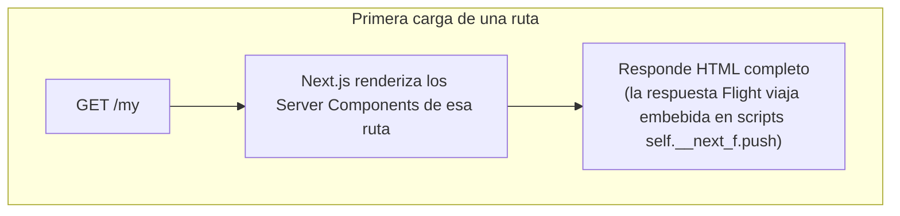
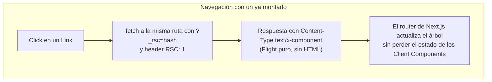
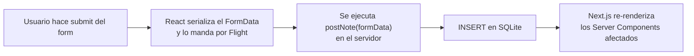
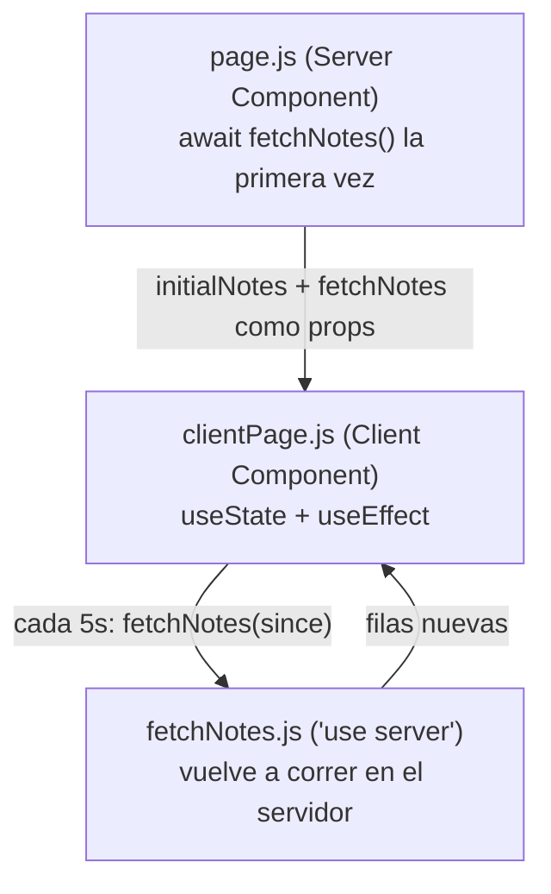

# React Server Components (RSC) con Next.js

Esta carpeta es la misma idea conceptual que `03-rsc-no-framework` (los mismos conceptos de RSC: componentes que solo renderizan en el servidor, `"use client"` para marcar interactividad, el protocolo React Flight viajando por debajo), pero con Next.js haciéndose cargo de todo lo que ahí armamos a mano: configuración de Webpack, el plugin que separa Server de Client Components, el manifest, el registro de Babel, y el servidor Fastify que arma la respuesta Flight. En el App Router de Next.js, todo componente es un Server Component por default, sin ninguna directiva ni configuración adicional.

Es la misma app, "Note Passer", una app de notas entre usuarios (con auth simplificada: siempre asumimos que estamos logueados como el usuario `1`) para poder enfocarse en RSC y no en construir un sistema de autenticación.


## Qué resuelve Next.js por vos

Todo lo que en `03-rsc-no-framework` era código explícito (el plugin de Webpack, el manifest, `renderToPipeableStream`, el registro de Babel en `server/main.js`) acá desaparece detrás del framework. Al navegar entre rutas, Next.js decide por vos si manda HTML (primera carga, con SSR) o si manda una respuesta en formato React Flight (navegación del lado del cliente, con un `fetch` a la misma ruta agregando `?_rsc=<hash>` y el header `RSC: 1`).





## Server Actions: formularios sin escribir un endpoint

La otra pieza nueva respecto a `03-rsc-no-framework` son las Server Actions: funciones marcadas con `"use server";` que se pueden pasar directamente al atributo `action` de un `<form>`. React se encarga de todo el transporte de datos entre el navegador y esa función, sin necesidad de escribir un handler HTTP ni un `fetch` manual.



## Mezclar Server y Client Components

Un Server Component puede pasarle datos iniciales a un Client Component como props, y eso incluye pasarle una Server Action como si fuera una función común. El Client Component puede llamar a esa función más adelante (por ejemplo, desde un `setInterval`) y React la sigue tratando como una llamada al servidor, no como código que se ejecuta en el navegador.



## La limitación direccional de los RSC, y el workaround

Los Server Components renderizan primero, los Client Components después. Eso tiene una consecuencia molesta: no hay forma de que datos que solo existen en el cliente (estado, un input del usuario) alimenten a un Server Component después de que ya renderizó. Si un Server Component necesita algo que solo el cliente conoce, la única salida real es volver al patrón clásico: un Client Component que hace `fetch` a un endpoint.

Cuando el Server Component no depende de nada del cliente, hay un workaround: renderizarlo primero y pasar el resultado ya renderizado como `children` a un Client Component. Eso es exactamente lo que hace `who-am-i`, y se ve mejor en el código más abajo.

## Los archivos del proyecto, y qué hace cada uno

### `src/app/layout.tsx` — el layout raíz

```tsx
export default async function RootLayout({ children }: PropsWithChildren) {
  return (
    <html lang="en">
      <body className="doodle">
        <nav>
          <h1>
            <Link href="/">Note passer</Link>
          </h1>
        </nav>
        {children}
      </body>
    </html>
  );
}
```

Envuelve todas las páginas. Es un Server Component `async` (sin ninguna directiva) que Next.js renderiza una sola vez por request y reutiliza entre navegaciones del lado del cliente, algo que en `03-rsc-no-framework` había que armar a mano con la shell HTML y el wildcard `<!--ROOT-->`.

### `src/app/page.tsx` — el home

Solo una lista de `<Link>` hacia las cuatro rutas que demuestran cada concepto: `/my`, `/write`, `/teacher`, `/who-am-i`. No tiene lógica de servidor, está ahí para poder navegar entre los ejemplos.

### `src/app/my/page.tsx` — el mismo Server Component que en `03-rsc-no-framework`

```tsx
export default async function MyNotes() {
  async function fetchNotes() {
    const db = await AsyncDatabase.open("./notes.db");
    const fromPromise = db.all<Note>(/* ... WHERE from_user = ? */, ["1"]);
    const toPromise = db.all<Note>(/* ... WHERE to_user = ? */, ["1"]);
    const [from, to] = await Promise.all([fromPromise, toPromise]);
    return { from, to };
  }
  const notes = await fetchNotes();
  // ... dos tablas, "Notes To You" y "Notes From You"
}
```

Es la misma idea que `ServerComponent.jsx` en `03-rsc-no-framework`: una función `async` que abre SQLite directamente y hace dos queries en paralelo con `Promise.all`. La diferencia es todo lo que no está: no hay manifest que leer, no hay `renderToPipeableStream`, no hay que decidir manualmente el `Content-Type` de la respuesta. Next.js decide cuándo esto viaja como HTML o como Flight.

### `src/app/write/page.tsx` y `postNote.ts` — el primer Server Action

```tsx
<form action={postNote} className="note-form">
```

```ts
"use server";
export default async function postNote(formData: FormData) {
  const from = formData.get("from_user");
  const to = formData.get("to_user");
  const note = formData.get("note");
  if (!from || !to || !note) throw new Error("Wtf bor, I need all those things");
  const db = await AsyncDatabase.open("./notes.db");
  await db.run("INSERT INTO notes (from_user, to_user, note) VALUES (?,?,?)", [from, to, note]);
}
```

`write/page.tsx` es un Server Component que consulta la lista de usuarios (para llenar los `<select>`) y renderiza un formulario común, salvo por un detalle: el `action` del `<form>` no es una URL, es directamente la función `postNote`, importada de otro archivo. Esa función necesita el `"use server";` al inicio para que React sepa que tiene que ejecutarse en el servidor y no intentar meterla en el bundle del navegador; sin esa directiva, la app se rompe. Al hacer submit, React serializa el `FormData` del formulario, lo manda al servidor por Flight, y ahí `postNote` corre el `INSERT` directo contra SQLite.

### `src/app/teacher/` — polling combinando Server y Client Components

```tsx
// page.tsx (Server Component)
export default async function TeacherView() {
  const initialNotes = await fetchNotes();
  return <TeacherClientPage initialNotes={initialNotes} fetchNotes={fetchNotes} />;
}
```

```ts
// fetchNotes.ts ('use server')
export default async function fetchNotes(since?: any) {
  const db = await AsyncDatabase.open("./notes.db");
  // con since: WHERE n.id > ? LIMIT 50 | sin since: LIMIT 50
}
```

```tsx
// clientPage.tsx ('use client')
export default function TeacherClientPage({ fetchNotes, initialNotes }) {
  const [notes, setNotes] = useState(initialNotes ?? []);
  useEffect(() => {
    const interval = setInterval(async () => {
      const since = notes.length > 0 ? notes[notes.length - 1]?.id ?? null : undefined;
      const newNotes = await fetchNotes(since);
      setNotes([...notes, ...newNotes]);
    }, 5000);
    return () => clearInterval(interval);
  }, []);
  // ... lista de notas
}
```

`page.tsx` hace la primera carga de datos en el servidor (`await fetchNotes()`) y le pasa el resultado a `clientPage.tsx` como prop, junto con la función `fetchNotes` en sí misma. Lo interesante es que `fetchNotes` sigue siendo una Server Action (tiene `"use server";`), así que cuando el `useEffect` la llama cada 5 segundos con `setInterval`, esa llamada no ejecuta la función en el navegador: React la intercepta y la convierte en una nueva llamada al servidor, con el último `id` visto como parámetro `since` para traer solo las notas nuevas. El resultado combina lo mejor de los dos mundos: la carga inicial no espera un segundo `fetch` después de montar, y el polling puede seguir pidiendo datos frescos sin volver a renderizar toda la página.

### `src/app/who-am-i/` — el workaround para la limitación direccional

```tsx
// page.tsx
export default async function WhoAmIPage() {
  return (
    <ClientPage id={1}>
      <WhoAmI />
    </ClientPage>
  );
}
```

```tsx
// whoAmI.tsx (Server Component)
async function getWhoAmI() {
  const db = await AsyncDatabase.open("./notes.db");
  return db.get<User>("SELECT * FROM users WHERE id = ?", ["1"]);
}
export default async function WhoAmI() {
  const user = await getWhoAmI();
  return <p>You are {user.name} and your id is {user.id}</p>;
}
```

```tsx
// clientPage.tsx ('use client')
export default function ClientWhoAmIPage({ children, id }) {
  return (
    <div>
      {children}
      <form action={updateUsername}>
        <input type="text" name="username" />
        <input type="hidden" name="id" value={id} />
        <button type="submit">Submit</button>
      </form>
    </div>
  );
}
```

Acá está el patrón descrito más arriba: `WhoAmIPage` renderiza `WhoAmI` (un Server Component que consulta la base) y lo pasa como `children` a `ClientPage` (un Client Component). Esto funciona porque `WhoAmI` no necesita nada que solo exista en el cliente, se puede renderizar por completo antes de que `ClientPage` entre en juego. `ClientPage` simplemente muestra ese resultado ya renderizado y agrega su propio formulario, con otra Server Action (`updateUsername.ts`) que actualiza el nombre en la base y usa `redirect("/")` para volver al home después de guardar.

Si `WhoAmI` necesitara, por ejemplo, el valor actual de un input controlado por el usuario antes de hacer su query, este truco ya no alcanzaría: no hay forma de que ese valor viaje de vuelta a un Server Component que ya renderizó. En ese caso la salida es la de siempre, un Client Component que hace `fetch` a algún endpoint.

## Cómo probarlo

```bash
npm run dev
```

Y entrando a `http://localhost:3000`, navegar por los cuatro links del home:

- **`/my`**: tabla de notas para el usuario `1`, sin ninguna interactividad. Si abrís las herramientas de red y navegaste ahí con un `<Link>` (no con una recarga completa), vas a ver el `fetch` con `?_rsc=` y `Content-Type: text/x-component`.
- **`/write`**: completá el formulario y hacé submit. En el network tab aparece una request `POST` a la misma ruta con un header `Next-Action`, en vez de una request tradicional a un endpoint propio.
- **`/teacher`**: dejalo abierto y escribí una nota nueva desde `/write` en otra pestaña. A los pocos segundos debería aparecer sola en la lista, sin recargar `/teacher`.
- **`/who-am-i`**: cambiá el username y hacé submit. La página redirige al home después de actualizar la base.

## Limitaciones de los RSC

Server Components renderizan primero, Client Components después, y ese orden no se puede invertir: no hay manera de que el estado de un Client Component alimente a un Server Component después de montado, más allá del workaround de pasarlo como `children` visto en `who-am-i` (que solo funciona si ese Server Component no depende de nada del cliente). Cuando sí depende, no queda otra que volver al patrón de siempre: un Client Component pidiendo datos por `fetch` a un endpoint propio. A esto se le suma lo que ya mencionamos en `03-rsc-no-framework`: el protocolo React Flight es inestable y no está pensado para tocarse a mano, y hoy en día usar RSC en serio implica apoyarse en un framework (Next.js, o próximamente React Router v7/Remix y TanStack Start) en lugar de armar el bundler y el servidor a mano.
